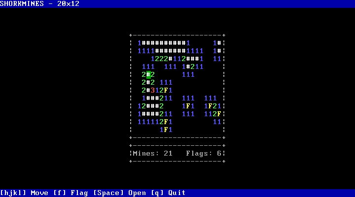
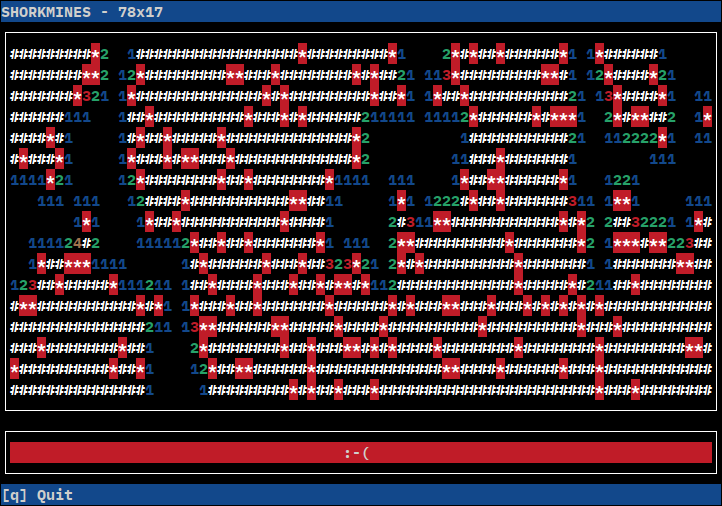

# SHORKMINES

An ncurses-based minesweeper game. It is a fork of Joel Ekström's [terminal-mines](https://github.com/joelekstrom/terminal-mines), which is a reference frontend for [libminesweeper](https://github.com/joelekstrom/libminesweeper). SHORKMINES is modified for use with SHORK Operating Systems such as [SHORK 486](https://github.com/SharktasticA/SHORK-486).

## Installing

### Quick compilation

_This assumes you already have the prerequisites for compilation installed._

    curl -fsSL https://raw.githubusercontent.com/SharktasticA/shorkmines/refs/heads/master/install.sh | bash

## Building

### Requirements

You will need C and C++ compilers (tested with GCC with either glibc or musl), `make`, `git` and ncurses.

### Compilation

When in SHORKMINES' source code directory, first run `git submodule update --init` to pull libminesweeper, then simply run `make`.

### Installation

Run `make install` to install to `/usr/bin` (you may need `sudo` if not installing as root). If you want to install it elsewhere, you can override the install location prefix like `make PREFIX=/usr/local install`.

### Uninstalling

Simply run `make uninstall` when in SHORKMINES' source code directory (you may need `sudo` if not uninstalling as root).

## Running

Usage: shorkmines [OPTIONS]

### Options

* `-h`, `--height` Specifies the game board's height (will be clamped if taller than window)
* `--help`: Shows help information and exits
* `-m`, `--mine-density`: Specifies how many mines will be placed in the game board (from 0.0 for no mines to 1.0 for all mines)
* `-w`, `--width`: Specifies the game board's width (will be clamped if wider than window)
* `-v`, `--version`: Displays version number and exits

### Key binds

<table>
  <tr><th>Key</th><th>Function</th><th>Key</th><th>Function</th><th>Key</th><th>Function</th></tr>
  <tr><td>h/a/left arrow</td><td>Move cursor left</td><td>j/s/down arrow</td><td>Move cursor down</td><td>k/w/up arrow</td><td>Move cursor up</td></tr>
  <tr><td>l/d/right arrow</td><td>Move cursor right</td><td>f/g</td><td>Place/remove flag</td><td>Space/,</td><td>Open tile</td></tr>
  <tr><td>q</td><td>Quit</td><td></td><td></td><td></td><td></td></tr>
</table>

## Screenshots

